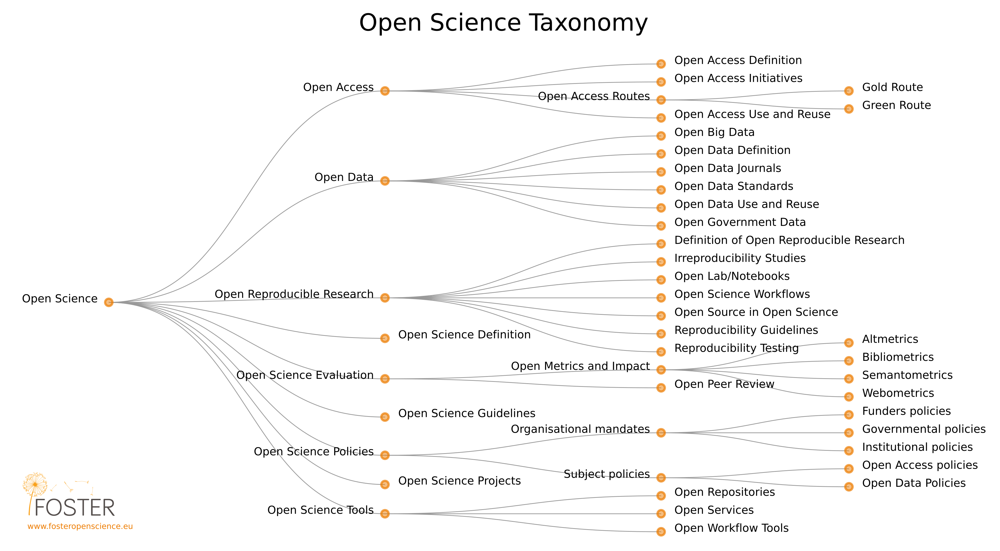

class: inverse, middle, title-slide, spaced

```{r setup, include=FALSE}
library(fontawesome)
library(tidyverse)
library(emo)
options(htmltools.dir.version = FALSE, width=120)
```

class: title-slide, spaced

 

# Berkenalan dengan #SainsTerbuka (*Open Science*)

### Dipersembahkan oleh...

## Komunitas #SainsTerbuka Airlangga `r fa("universal-access")`

Hubungi kami di `r emo::ji("point_down")`

* `r fa("paper-plane")` <a href="mailto:sainsterbuka.ua@gmail.com"></i>&nbsp; sainsterbuka.ua@gmail.com</a>
* `r fa("twitter")` [@sainsterbukaUA](https://twitter.com/sainsterbukaUA)
* `r fa("github")` [@sainsterbukaua](https://github.com/sainsterbukaua)
* `r fa("desktop")` https://sainsterbukaUA.github.io
* `r fa("facebook-f")` [Komunitas Sains Terbuka Airlangga](https://www.facebook.com/SainsTerbukaAirlangga/)


---

class: center, middle

# Memperkenalkan #SainsTerbuka Airlangga


Materi dalam paparan ini berlisensi `r fa("creative-commons")` 1.0 (*public domain*) dan tersedia di laman web #SainsTerbuka Airlangga **(https://sainsterbukaua.github.io/activities/)**. 
Kode tersedia secara terbuka di [repositori](https://github.com/sainsterbukaUA/materi-presentasi) `r fa("github")` kami.

---

class: inverse

# Daftar topik

.pull-left[

* Sains saat ini baik-baik saja kan?

* Mengapa krisis kredibilitas sains adalah... krisis?

* Apa? #SainsTerbuka?

* Apa sih manfaatnya?

* Bagaimana caranya?

]

.pull-right[


]

---

# Sains **tidak** sedang baik-baik saja.. (1)

.pull-left[

* Bayangkan...

  - Seandainya anda sedang berjalan di Jalan Dharmawangsa dan melihat seseorang yang mirip mantan anda. Pada **pengamatan pertama**, mungkin anda tidak terlalu yakin bahwa orang tersebut adalah mantan anda.
  
  - Namun setelah **observasi berkali-kali** (dengan memutar jalan dan melihatnya untuk kedua, ketiga kali), anda akan yakin bahwa orang yang anda amati tersebut adalah mantan/bukan mantan anda.
  
]

.pull-right[


]


---

# Sains **tidak** sedang baik-baik saja.. (2)

.pull-left[

* Ada banyak klaim saintifik yang **gagal dikonfirmasi** kesahihannya
  - Peneliti mendapati temuan yang berbeda, dari **dataset yang persis sama**. Temuan sangat bergantung pada kombinasi keputusan yang diambil selama proses penelitian [(*researcher degrees of freedom*)](https://www.ncbi.nlm.nih.gov/pmc/articles/PMC5122713/).
  - Ketika sekelompok peneliti mencoba untuk **mengulangi prosedur** yang sama dari penelitian yang sudah dilaporkan sebelumnya, temuan penelitian ternyata **tidak konsisten dengan studi aslinya**.
  - Jangan-jangan, peneliti pada **'salah lihat'** [(*false positive*)](https://journals.sagepub.com/doi/full/10.1177/0956797611417632)
  - Yang mengkhawatirkan, terjadi di banyak sekali disiplin ilmu. Termasuk [kedokteran](https://doi.org/10.1126/scitranslmed.aaf5027), [biologi](https://link.springer.com/article/10.1007/s11538-018-0497-0), [kimia](https://pubs.acs.org/doi/abs/10.1021/acs.jchemed.7b00907), [hidrologi](https://www.nature.com/articles/sdata201930?fbclid=IwAR3nMcbsjpDOQxj9jxLBxYsrdTmcjBTUq3CsWydyW0pl-PPmwKe8hiZsOQg#f2), [psikologi](https://www.pnas.org/content/115/11/2628), dan banyak lagi!
]

.pull-right[


]

---

class: middle, center, inverse

# File-Drawer Problem

*File-drawer* adalah kecenderungan peneliti untuk 'menyimpan' hasil penelitian yang tidak ia harapkan/negatif.


---

# Mengapa ini menjadi masalah?

.pull-left[
* Peneliti akan terdorong untuk *melakukan apa saja yang perlu*, agar studinya dapat dipublikasikan
  - Berkaitan dengan prestise, *reward system*, dll.

* Orang awam makin terdorong untuk **tidak percaya** pada sains dan ilmuwan, akibat krisis kredibilitas dan intergritas yang menjangkit komunitas akademik

* Membuat **sains** dan ~~pseudosains~~ menjadi semakin sulit dibedakan

* Meta-sains (sains kumulatif, misalnya, *systematic review* dan meta-analisis) menjadi sulit dipercaya karena terjadi bias publikasi (akibat *file-drawer effect*)

]

.pull-right[

]

---

class: center, middle

# Apa yang sebenarnya dilakukan peneliti?


.footnote[
[Munafo et al. (2017)](https://www.nature.com/articles/s41562-016-0021)
]

---

class: center, inverse, middle

# Lalu apa yang bisa dilakukan?

--


--

# #SainsTerbuka

---

# Apa? #SainsTerbuka?

--
> "...Open Science is the practice of science in such a way that others can **collaborate and contribute**, where research data, lab notes and other research processes are **freely available**, under terms that enable **reuse**, **redistribution** and **reproduction** of the research and its underlying data and methods.." [(FOSTER Open Science)](https://www.fosteropenscience.eu/foster-taxonomy/open-science-definition)

--

## Namun pada dasarnya

Sains Terbuka berangkat pada kesadaran bahwa **ilmu pengetahuan** adalah **komoditas milik publik**, sehingga harus **terbuka** bagi publik dan **tidak seharusnya** dimanfaatkan oleh seorang/sekelompok orang saja.

---

class: center, inverse, middle

# Taksonomi #SainsTerbuka (1)


---

class: center, inverse, middle

# [Taksonomi #SainsTerbuka (2)](https://www.fosteropenscience.eu/foster-taxonomy/open-science-definition)



---

class: center, middle

# Siklus proses riset yang dapat **dibuka**


---

# Keuntungan mengadopsi #SainsTerbuka (1)

* Meningkatkan kualitas riset dan pelaporannya
* Memungkinkan *networking* dan kolaborasi yang lebih luas
* Mereformasi cara ilmuwan mengelola relasi (lebih adil, terbuka, dan egaliter)
* Memperluas dampak riset
* Menambah motivasi intrinsik

---

class: middle, center, inverse

# Keuntungan mengadopsi #SainsTerbuka (2)


---

# Bagaimana caranya?

.pull-left[


]

.pull-right[


]

---

# Manifesto #SainsTerbuka Airlangga<sup>*</sup>

* Mendorong peneliti untuk menyadari potensi terjadinya bias kognitif yang berakar dari keterbatasannya pribadi ketika melaksanakan penelitian
* Menggarisbawahi pentingnya pelatihan metodologi, utamanya bagi peneliti pemula dan mahasiswa
* Mempromosikan kolaborasi dan pendekatan tim saintis
* Mempromosikan praktik baik dalam meneliti (*good research practices*)
* Mendorong peneliti untuk melakukan [pra-registrasi](https://cos.io/prereg/) dan menggunakan format [laporan teregistrasi](https://cos.io/rr/)
* Menekankan pentingnya peningkatan kualitas pelaporan penelitian (lengkap dan *reproducible*)
* Mendorong penggunaan piranti lunak dengan prinsip sumber terbuka (*open source*) dan *reproducible* (misalnya [`r fa("r-project")`](https://www.r-project.org/), [`r fa("python")`](https://www.python.org/) atau yang lainnya)
* Mendorong evaluasi kinerja peneliti dengan menggunakan prinsip transparansi dan keterbukaan (contohnya [Transparency and Openness Promotion (TOP) Guideline](https://cos.io/top/) dari [Center for Open Science](https://cos.io/about/mission/)) tidak sekedar menggunakan metrik proksi, seperti H-Index, JIF, dsb.
* Mendorong pembatasan penggunaan metrik proksi dan mendorong pengambil keputusan menggunakan metrik-metrik tersebut secara bertanggung jawab, sesuai dengan [San Fransisco Declaration of Research Assessments (SF-DORA)](https://sfdora.org/read/)

.footnote[

[*] Terinspirasi dari [Munafò, M. R., Nosek, B. A., Bishop, D. V., Button, K. S., Chambers, C. D., Du Sert, N. P., ... & Ioannidis, J. P. (2017). A manifesto for reproducible science. Nature Human Behaviour, 1(1), 0021.](https://www.nature.com/articles/s41562-016-0021;)

]

---

class: middle, center

# Mengubah kebiasaan memang tak mudah...


---

class: inverse, middle, center

# Yang mungkin juga menarik...

Kursus Daring Terbuka Masif (KTDM - MOOC) Sains Terbuka Indonesia

--


--

# **http://bit.ly/MOOCsainter**


---

class: center, middle

# Terima kasih banyak!


Paparan disusun dengan menggunakan `r fa("r-project")` *package* [**xaringan**](https://github.com/yihui/xaringan) dengan *template* dan *fonts* dari `R-Ladies`.

*Chakra* dibuat dengan [remark.js](https://remarkjs.com), [**knitr**](http://yihui.name/knitr), dan [R Markdown](https://rmarkdown.rstudio.com).
