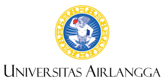
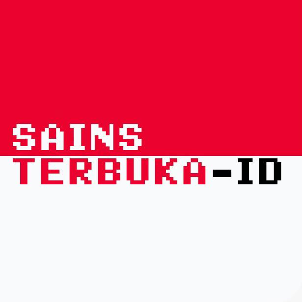

class: inverse, middle, title-slide, spaced

```{r setup, include=FALSE}
library(fontawesome)
library(tidyverse)
library(emo)
options(htmltools.dir.version = FALSE, width=120)
```

class: title-slide, spaced

   

# Pengarsipan Mandiri (*Self-Archiving*)
## Workshop JAKI & The Conversation Indonesia Masterclass
<br>
### <b>Rizqy Amelia Zein</b>
* Dosen, [Fakultas Psikologi, Universitas Airlangga](https://psikologi.unair.ac.id)
* Anggota, [#SainsTerbuka Airlangga](https://sainsterbukaua.github.io/) `r fa("universal-access")`
* Relawan, [INA-rxiv](https://inarxiv.id) 
* Researcher-in-training, [Institute for Globally Distributed Open Research and Education (IGDORE)](https://igdore.org/)

---

class: center, middle

# Menghubungi saya?  

`r fa("paper-plane")` <a href="mailto:amelia.zein@psikologi.unair.ac.id"></i>&nbsp; amelia.zein@psikologi.unair.ac.id</a>
`r fa("twitter")` [@ameliazein](https://twitter.com/ameliazein)
`r fa("github")` [@rameliaz](https://github.com/rameliaz)
`r fa("desktop")` https://rameliaz.github.io


Materi dalam paparan ini berlisensi `r fa("creative-commons")` 1.0 (*public domain*) dan tersedia di laman web #SainsTerbuka Airlangga **(https://sainsterbukaua.github.io/activities/)**. 
Kode tersedia secara terbuka di [repositori](https://github.com/sainsterbukaUA/materi-presentasi) `r fa("github")` saya.

---

class: inverse

# Topik Utama 

.pull-left[
* Mengapa karya ilmiah harus terbuka?
* Beberapa pilihan akses terbuka
* Kisah sepotong roti dan pengarsipan
* Anatomi *pre-print*
* Manfaat mengarsipkan karya secara mandiri
* Beberapa cara mengarsipkan karya secara mandiri
]


.pull-right[

]

---

# Mengapa karya ilmiah sebaiknya dapat diakses terbuka?

.pull-left[ 
* Ilmu pengetahuan adalah **komoditas milik publik**, sehingga tak boleh hanya disimpan, digunakan, dan dimanfaatkan oleh seorang/sekelompok orang untuk kepentingan pribadi/kelompok tertentu
* Apabila karya kita dapat diakses terbuka, maka akan **lebih mudah ditemukan** oleh yang pembaca yang membutuhkan
* Akses terbuka pada karya ilmiah dapat **mengakselerasi inovasi dan perkembangan sains**, **memperluas dampak riset**, dan **membuka kesempatan kolaborasi**
* Investasi dana riset baru akan **kelihatan hasilnya**, kalau hasil riset dikomunikasikan di *outlet* yang dapat diakses secara terbuka
* Model bisnis publikasi cenderung **mahal dan tidak efisien** (butuh waktu lama untuk diseminasi)
* **Sumberdaya** lembaga penelitian/universitas **terbatas**, tidak mungkin bisa diharapkan untuk terus membayar biaya langganan dalam jangka panjang
]

.pull-right[

]

---

class: middle, center

# Akses terbuka, singkatnya...

<iframe width="560" height="315" src="https://www.youtube.com/embed/L5rVH1KGBCY" frameborder="0" allow="accelerometer; autoplay; encrypted-media; gyroscope; picture-in-picture" allowfullscreen></iframe>


---

class: middle, inverse, center

# *Gold* dan *Green Open Access*


---

class: center, middle, inverse, spaced

# Pengarsipan dan Kisah Sepotong Roti<sup>*</sup>


.footnote[
[*] [Irawan, 2019](https://medium.com/open-science-indonesia/proses-pembuatan-roti-dan-pengarsipan-mandiri-bcf22cdd5d0)
]

---

# Beberapa istilah penting

* **Pre-print** (*author original* atau *author's version*)
  - Merupakan naskah draf yang **pertama kali diserahkan** kepada editor jurnal dan belum tersentuh proses editorial ataupun tinjauan sejawat (*peer-review*) sama sekali.

--

* **Post-print** (*accepted manuscript*, *second-stage manuscript*, atau *final draft*)
  - Merupakan naskah yang **sudah melalui** proses tinjauan sejawat dan dinyatakan **diterima** untuk dipublikasikan.

--

* **Publisher's version** (*version of record* atau *published version*)
  - Merupakan naskah final yang **sudah diterbitkan**, sudah di *typeset* (ditata letak), ditinjau akhir (*copyediting*), dan sudah lengkap bersama dengan komponen penyerta (*supplementary materials*).

--

* **Embargo** (*delayed open access*)
  - Beberapa jurnal komersial berbasis langganan menerapkan kebijakan untuk membuat kontennya dapat **diakses terbuka** setelah **melewati jangka waktu tertentu**. Biasanya sekitar 1-5 tahun, meskipun ada beberapa jurnal yang menerapkan jangka waktu yang lebih pendek atau lebih panjang, misalnya 3 bulan atau bahkan 10 tahun.

---

class: center, middle, inverse

# Cek kebijakan jurnal!

Sebelum mengarsipkan, cek kebijakan jurnal terlebih dahulu di...

--


--

# **http://sherpa.ac.uk/romeo/index.php**

---

class: center, middle

# Mengarsipkan *pre/post-print* pada jurnal dengan biaya langganan (*paywalled*)


---

class: center, middle, inverse, spaced

# Anatomi *pre-print*


---

class: center, middle

# Apa manfaatnya?


---

# Bagaimana caranya?

--

Unggah naskah di *repositori kampus* atau *pre-print server* 

--


---

class: inverse

# *Pre-print server* dikelola oleh orang Indonesia `r emo::ji("100")`

.pull-left[

* INA-rxiv (**https://inarxiv.id**)

* Di*hosting* oleh [Center for Open Science](https://cos.io/) dan bagian dari [Open Science Framework *Pre-Prints*](https://osf.io/preprints/)

* Dikelola/dimoderasi oleh orang Indonesia
  - Relawan berasal dari berbagai universitas di Indonesia
]

.pull-right[


]

---

# Bagaimana cara menavigasikan INA-rxiv?

.pull-left[
* [Berkenalan dengan INA-rxiv](https://medium.com/open-science-indonesia/ina-rxiv-2a51aae69d3a)

* [*Frequently asked questions* (FAQ) INA-rxiv](https://medium.com/open-science-indonesia/faq-tentang-inarxiv-85d2ba736424)

* [Panduan mengunggah naskah ke INA-rxiv](https://medium.com/open-science-indonesia/ina-rxiv-membuka-penerimaan-makalah-3813becde7f)

]

.pull-right[

]

---

# Beberapa persepsi keliru

**Lho, kalau saya mengunggah pre/post-print, bukankah karya/ide saya akan mudah dicuri orang?**

--

Justru dengan mengunggah *pre/post-print*, kita jadi punya bukti untuk mengklaim ide kita. Selain itu, mengunggah *pre/post-print* artinya kita sedang melindungi hak kita sebagai penulis.

--

**Kalau naskah publisher's version dan pre/post-print sama-sama dapat diakses secara digital, terindeks, dan mendapat DOI, apakah berarti saya melakukan self-plagiarism/duplikasi?**

--

**Tidak**. *Pre/post-print* termasuk sebagai naskah yang **tidak terpublikasi**, namun dapat diakses secara terbuka. Sama halnya seperti naskah skripsi/tesis/disertasi yang diunggah di repositori kampus dan dapat diakses terbuka.

--

**Bagaimana kalau ketika mengurus kenaikan pangkat, karya ilmiah saya ditemukan memiliki similarity index tinggi, hanya karena publisher's version dan pre/post-print sama-sama tersedia secara daring?**

--

Tim Integritas Akademik yang dibentuk Kementerian Riset, Teknologi, dan Pendidikan Tinggi sudah memberikan jaminan bahwa kemiripan naskah terpublikasi dengan *pre/post-print* yang diunggah di *pre-print server* akan **mendapat pengecualian**.

---

class: inverse, middle, center

# Yang mungkin juga menarik...

Kursus Daring Terbuka Masif (KTDM - MOOC) Sains Terbuka Indonesia

--



--

# **http://bit.ly/MOOCsainter**


---

class: center, middle

# Terima kasih banyak!


Paparan disusun dengan menggunakan `r fa("r-project")` *package* [**xaringan**](https://github.com/yihui/xaringan) dengan *template* dan *fonts* dari `R-Ladies`.

*Chakra* dibuat dengan [remark.js](https://remarkjs.com), [**knitr**](http://yihui.name/knitr), dan [R Markdown](https://rmarkdown.rstudio.com).
